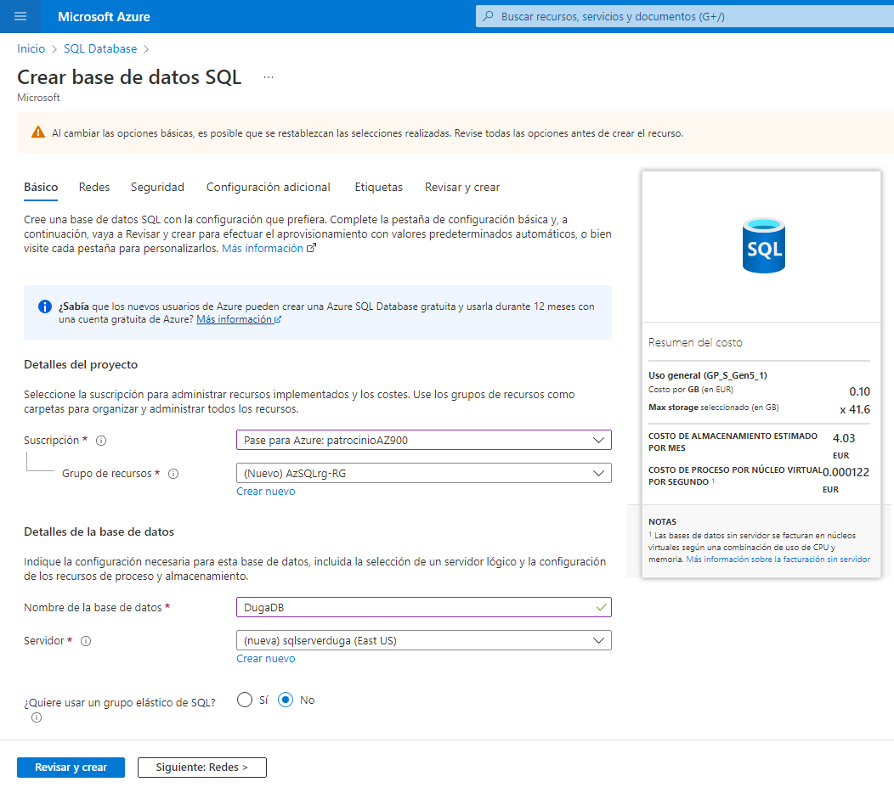
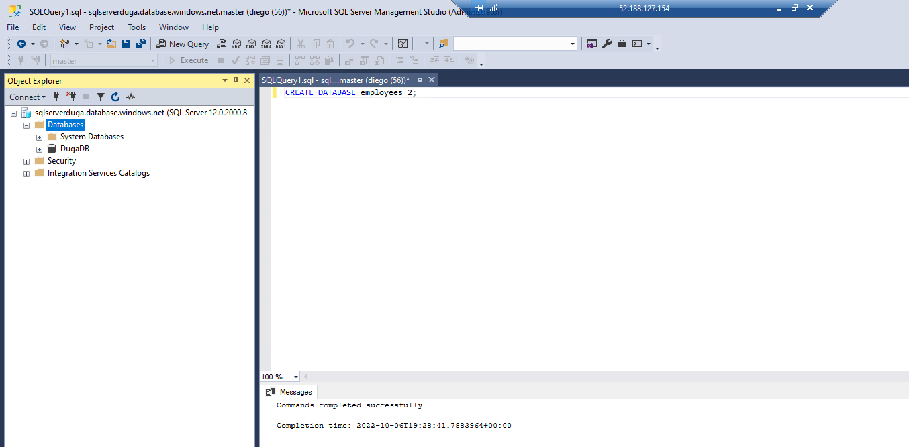
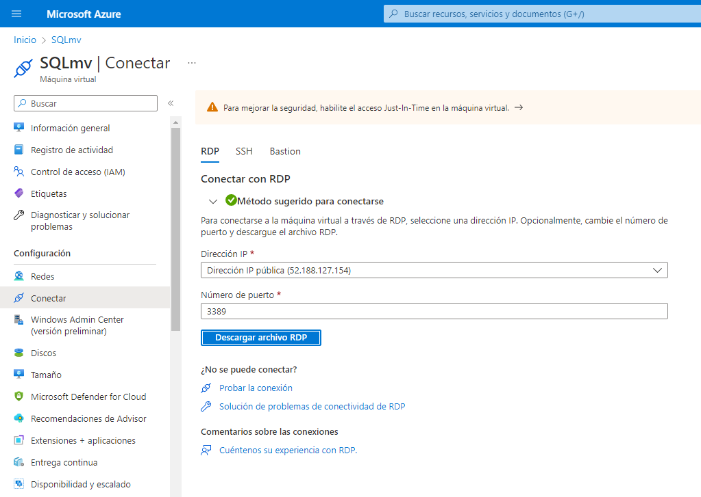
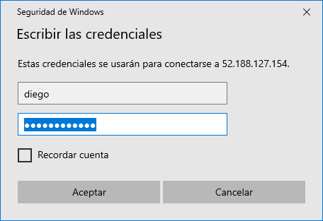
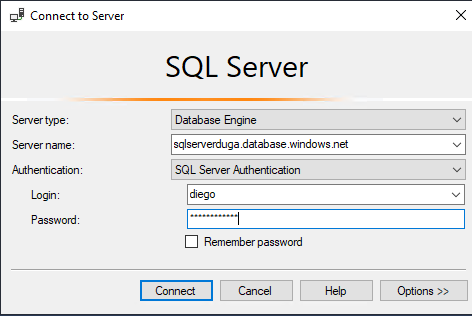
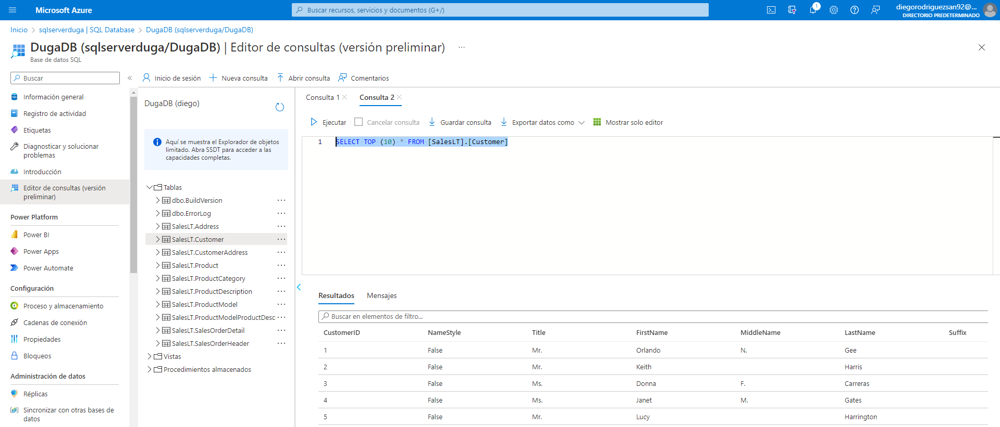
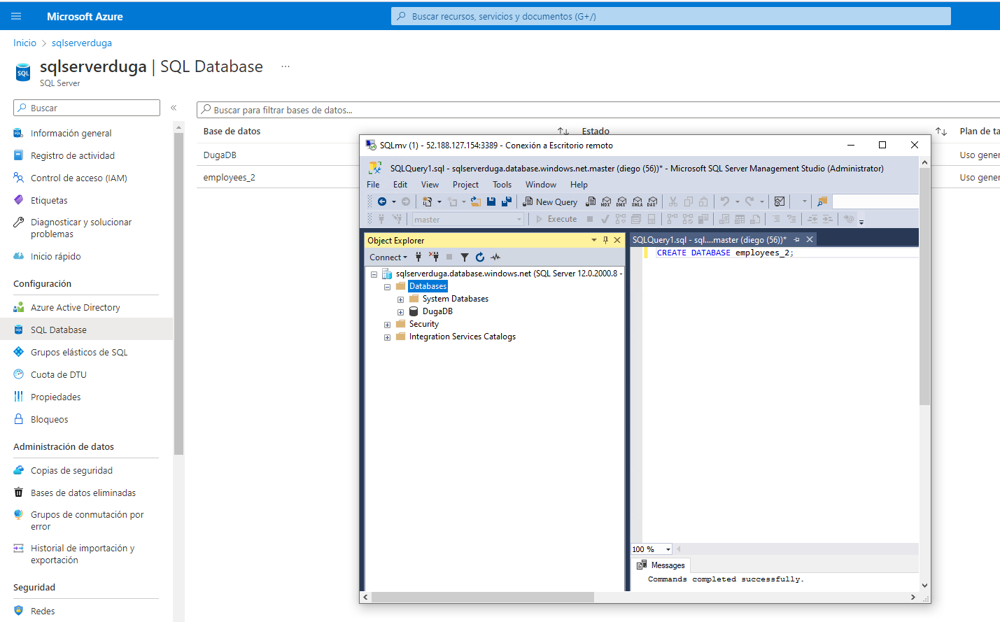

# Azure SQL Database

En este ejercicio vamos a levantar una máquina virtual mediante la que administraremos bases de datos Azure SQL.

En primer lugar creamos la base de datos SQL en Azure con los siguientes parámetros:
- Servidor -> Método de autenticación: SQL authentication. El nombre del servidor debe ser único porque será accesible desde fuera.
- Punto de conexión público.
- ✅ Permitir que los servicios y recursos de Azure accedan a este servidor.
- ❌ Agregar dirección IP del cliente actual.
- Usar datos existentes: muestra. De esta forma se crea una BD automáticamente de muestra con la que podemos comprobar que funciona correctamente. Luego podremos añadir nuestras propias DB.
- Revisar y crear.

Copiamos la cadena de conexión de la base de datos del servidor y la guardamos en el portapapeles para usarla más adelante.

Una vez creada la DB, creamos la máquina virtual que va a gestionarla, de forma que vamos a Máquinas virtuales de SQL (NO SQL database y NO Instancias administradas de SQL) y la creamos con los siguientes parámetros:
- Imagen: Free SQL Server License.

- La alojamos en el mismo RG que tenemos la DB.

- Mantenemos el puerto RDP 3389 abierto para poder conectarnos.

- Deshabilitamos Boot diagnostics.

- Habilitamos la autenticación de SQL y mantenemos la conectividad SQL pública mediante el puerto 1433.

- Revisar y crear.

Abrimos la VM recién creada y nos conectamos a ella mediante el archivo RDP que nos descargamos en su menú.

Para acceder debemos copiar el nombre del servidor desde la base de datos de Azure, que tendrá el siguiente formato: nombredelservidor.database.windows.net

Una vez dentro de Microsoft SQL Server Manager podemos trabajar en la DB.

A modo de ejemplo hemos creado una nueva base de datos desde la VM virtual para apreciar cómo trabaja en línea, y resulta muy interesante que se actualiza antes en Azure que en la VM.

